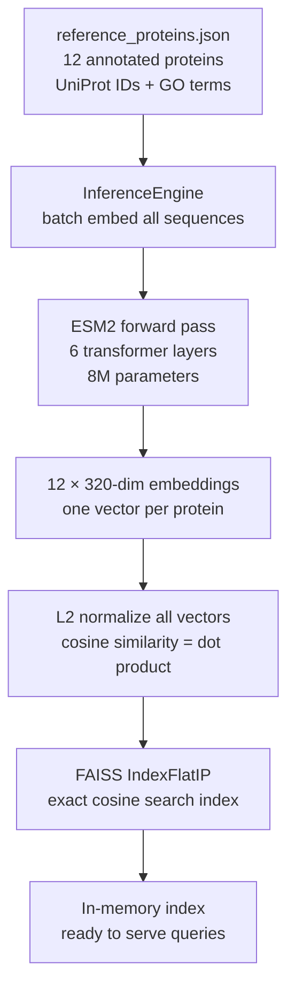
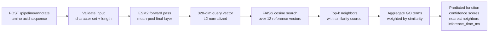
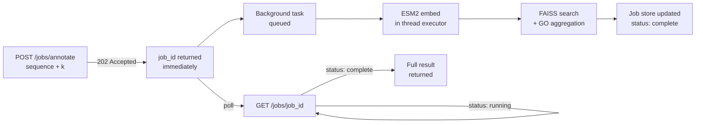

# ESM2 Inference Service

A production-ready protein sequence embedding, similarity search, and functional annotation API built on Meta's [ESM2](https://github.com/facebookresearch/esm) protein language model.

---

## Background & Motivation

While taking an Intro to AI course, I encountered formal knowledge representation systems — ontologies like the Gene Ontology (GO), which organizes all known protein functions into a structured hierarchy built by biologists over decades:

```
molecular_function
 └── catalytic activity
      └── transferase activity
           └── kinase activity
                └── tyrosine kinase activity
                     └── EGFR
```

This raised a question: **if a model is trained only on raw protein sequences — no labels, no ontology graphs — does it learn this structure implicitly?**

ESM2 gave a clear answer. Trained by Meta on 250 million protein sequences with a single objective (predict masked amino acids), it learns to encode evolutionary relationships into a continuous geometric space. Proteins that share ancestry, structure, and function end up near each other in that space — not because anyone told it what "kinase" means, but because kinases evolved from a common ancestor and share detectable sequence patterns.

This service is an exploration of that idea: **extracting implicit ontologies from learned embeddings**. Given any protein sequence, it embeds it into ESM2's learned space, finds its nearest neighbors in a curated reference database, and surfaces the Gene Ontology terms those neighbors carry — recovering structured biological knowledge from geometry alone.

---

## The Core Idea: Implicit Ontologies in Embedding Space

A formal ontology encodes knowledge as explicit symbols and relationships. ESM2's embedding space encodes the same knowledge implicitly — as geometry:

| Formal ontology concept | Embedding space equivalent |
|---|---|
| A concept (e.g. "kinase") | A cluster or linear subspace |
| A relationship (e.g. "IS-A transferase") | A direction in the space |
| An instance (e.g. EGFR) | An individual vector |

The result: querying a new, unknown protein against the embedding space is zero-shot functional annotation — no fine-tuning, no labels for the query, just geometry.

---

## Architecture

### Startup — building the reference index



### Synchronous query — embed, search, annotate



### Asynchronous jobs — submit, poll, retrieve



---

## Sample Output

### `POST /pipeline/annotate` — hemoglobin alpha fragment

```bash
curl -s -X POST http://localhost:8000/pipeline/annotate \
  -H "Content-Type: application/json" \
  -d '{"sequence": "MVLSPADKTNVKAAWGKVGAHAGEYGAEALERMFLSFPT", "k": 5}' \
  | python3 -m json.tool
```

```json
{
    "query_length": 39,
    "predicted_go_terms": [
        {"id": "GO:0020037", "name": "heme binding",          "category": "molecular_function", "confidence": 1.0},
        {"id": "GO:0005344", "name": "oxygen carrier activity","category": "molecular_function", "confidence": 1.0},
        {"id": "GO:0015671", "name": "oxygen transport",       "category": "biological_process", "confidence": 1.0},
        {"id": "GO:0005833", "name": "hemoglobin complex",     "category": "cellular_component", "confidence": 0.9151},
        {"id": "GO:0006123", "name": "mitochondrial electron transport", "category": "biological_process", "confidence": 0.2385}
    ],
    "nearest_neighbors": [
        {"uniprot_id": "P68871", "name": "Hemoglobin subunit beta", "similarity": 0.9606},
        {"uniprot_id": "P69905", "name": "Hemoglobin subunit alpha","similarity": 0.9557},
        {"uniprot_id": "P02144", "name": "Myoglobin",               "similarity": 0.8826},
        {"uniprot_id": "P99999", "name": "Cytochrome c",            "similarity": 0.7896},
        {"uniprot_id": "P0CG47", "name": "Ubiquitin",               "similarity": 0.7239}
    ],
    "inference_time_ms": 15.4
}
```

The model received 39 amino acids — a fragment it has never seen — and recovered the correct molecular function, biological process, and cellular component with confidence 1.0. The top 3 neighbors are the three known oxygen carriers in the reference set (Hb β, Hb α, myoglobin), clustering together in embedding space exactly as the formal Gene Ontology would predict.

### `GET /models` — service discovery

```bash
curl -s http://localhost:8000/models | python3 -m json.tool
```

```json
[
    {"id": "small",  "active": true,  "parameters": "8M",   "layers": 6,  "embedding_dim": 320,  "description": "Fast CPU inference. Good for development and high-throughput screening."},
    {"id": "medium", "active": false, "parameters": "35M",  "layers": 12, "embedding_dim": 480,  "description": "Balanced accuracy and speed. Suitable for production workloads."},
    {"id": "large",  "active": false, "parameters": "650M", "layers": 33, "embedding_dim": 1280, "description": "Highest quality embeddings. Recommended for precision annotation tasks."}
]
```

---

## API Reference

| Method | Endpoint | Mode | Description |
|--------|----------|------|-------------|
| `GET` | `/health` | — | Server, model, and index status + active model name |
| `GET` | `/models` | — | All available ESM2 variants, which is currently loaded |
| `POST` | `/embed` | sync | Single sequence → 320-dim embedding vector |
| `POST` | `/embed/batch` | sync | Up to 64 sequences → batch embeddings |
| `POST` | `/search` | sync | Sequence → k nearest reference proteins with similarity scores |
| `POST` | `/pipeline/annotate` | sync | Sequence → predicted GO terms + neighbors + inference time |
| `POST` | `/jobs/embed` | async | Submit batch embed job → `job_id` (returns immediately) |
| `POST` | `/jobs/annotate` | async | Submit annotate job → `job_id` (returns immediately) |
| `GET` | `/jobs/{job_id}` | async | Poll job status; result included when `status: complete` |

Full interactive docs at `http://localhost:8000/docs` when the server is running.

---

## Quickstart

**Install dependencies**
```bash
pip install -r requirements.txt
```

**Start the server**
```bash
python3 -m uvicorn src.server:app --reload
```

Startup takes ~10 seconds on first run: ESM2 downloads (~30MB), embeds 12 reference proteins, and builds the FAISS index. Subsequent starts use the cached model weights.

**Run the test suite**
```bash
python3 -m pytest tests/ -v
```
61 tests across model validation, pipeline logic, FAISS search, and HTTP integration. Completes in ~1.3 seconds.

---

## Extracting Implicit Ontologies: How It Works

### Why embeddings encode ontological structure

ESM2 was trained with masked language modeling: randomly mask amino acids in a sequence and train the model to predict them from context. To do this well, the model must learn *why* certain amino acids appear in certain positions — which means learning the evolutionary constraints that placed them there.

Those evolutionary constraints are the ontology. Proteins that share a common ancestor and function share sequence patterns, and the model learns to represent that shared history as proximity in embedding space.

### What each layer captures

| Layers | What's learned |
|--------|----------------|
| 1–2 | Local amino acid chemistry — charge, polarity, size |
| 3–4 | Secondary structure — which residues form helices or sheets |
| 5–6 | Long-range contacts and functional context |
| Final (−1) | Highest-level functional/evolutionary representation |

We extract the final layer and mean-pool across sequence positions, collapsing variable-length sequences into a single fixed-size vector — the protein's coordinates in ESM2's learned ontological space.

### From geometry to explicit annotations

The pipeline endpoint runs three steps:

1. **Embed** — ESM2 maps the query sequence to a point in 320-d space
2. **Search** — FAISS finds the k nearest reference proteins by cosine similarity
3. **Aggregate** — GO terms are weighted by neighbor similarity and ranked by confidence

A GO term shared by three high-similarity neighbors scores higher than one carried by a single distant neighbor. The result is a ranked list of predicted functions grounded entirely in learned geometry — no hand-crafted rules, no explicit ontology training.

---

## Connection to Compute Fundamentals

Every attention layer in ESM2 is three batched matrix multiplications (`Q`, `K`, `V` projections) followed by the scaled dot-product `QK^T / sqrt(d)`. The batching, memory-tiling, and cache strategies that make matrix multiplication efficient on CPU and GPU are exactly what PyTorch applies here at every transformer layer, on every sequence, in every batch.

At query time, the FAISS nearest-neighbor search is a dot product between the query vector and every reference vector — the same primitive. At 12 proteins this is trivial. At 570,000 (all of SwissProt), FAISS applies the same cache-aware geometric partitioning to keep it sub-millisecond.

The async job pattern maps to GPU memory management: for large models (650M, 3B parameters) or large batches, you don't block on the result — you submit and poll, giving the server freedom to schedule work efficiently across concurrent requests.

---

## Project Structure

```
esm2_inference_service/
├── src/
│   ├── model.py        # ESM2 load, tokenize, masked mean-pool forward pass
│   ├── inference.py    # Batching engine, input validation, tensor → Python types
│   ├── reference.py    # Reference database loader
│   ├── search.py       # FAISS IndexFlatIP with cosine similarity
│   ├── pipeline.py     # GO term aggregation weighted by similarity scores
│   ├── jobs.py         # In-memory job store, async background task functions
│   └── server.py       # FastAPI app, lifespan, all endpoints
├── data/
│   └── reference_proteins.json   # 12 annotated reference proteins
├── tests/
│   ├── conftest.py         # Session-scoped TestClient fixture
│   ├── test_model.py       # Input validation edge cases
│   ├── test_pipeline.py    # GO aggregation logic and confidence math
│   ├── test_search.py      # FAISS index correctness
│   ├── test_server.py      # HTTP integration tests for all sync endpoints
│   └── test_jobs.py        # Async job submission, polling, error handling
└── requirements.txt
```

---

## Reference Proteins

| Protein | UniProt | Function | Why it's here |
|---------|---------|----------|---------------|
| Ubiquitin | P0CG47 | Protein degradation tag | Universal regulatory protein, distinct embedding |
| Cytochrome c | P99999 | Mitochondrial electron carrier | Heme protein — neighbor to oxygen carriers |
| Hemoglobin α | P69905 | Oxygen transport | Cluster anchor for heme-binding proteins |
| Hemoglobin β | P68871 | Oxygen transport (sickle cell: E6V) | Near-identical GO terms to Hb α, tests clustering |
| Myoglobin | P02144 | Intracellular oxygen storage | Third heme protein — validates oxygen-carrier cluster |
| Calmodulin-1 | P0DP23 | Calcium signaling sensor | EF-hand motif, structurally distinct family |
| Alpha-synuclein | P37840 | Synaptic vesicle trafficking / Parkinson's | Disordered protein, no defined fold |
| SOD1 | P00441 | Antioxidant enzyme / familial ALS | Metal-binding enzyme, disease relevance |
| GFP | P42212 | Bioluminescent reporter | Non-human, unique beta-barrel fold |
| Insulin | P01308 | Glucose homeostasis hormone | Small secreted protein, disulfide-rich |
| Thioredoxin | P10599 | Redox regulation | Shares oxidoreductase function with cytochrome c |
| PCNA | P12004 | DNA replication sliding clamp | Nuclear protein, ring-shaped homotrimer |

Extending the reference set is one JSON record per protein — no code changes required. Scaling to all 570,000 reviewed proteins in SwissProt requires only a larger FAISS index.
