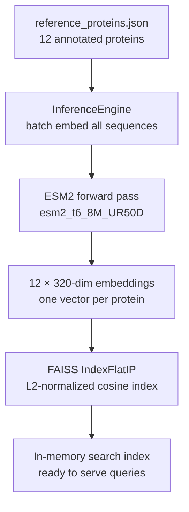
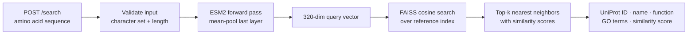
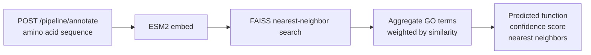

# ESM2 Inference Service

A production-ready protein sequence embedding and similarity search API built on Meta's [ESM2](https://github.com/facebookresearch/esm) protein language model.

Given any amino acid sequence, the service returns a dense embedding vector that encodes the protein's evolutionary history, structural propensity, and functional context — learned from 250 million protein sequences without any explicit labels. Those embeddings power a nearest-neighbor search over a curated reference database, surfacing functionally similar proteins and their Gene Ontology annotations in milliseconds.

---

## Why this exists

Proteins that share evolutionary ancestry share sequence patterns, structural folds, and biochemical function. ESM2 learned to encode those relationships into a continuous geometric space: proteins that do the same job cluster together, and the distance between any two points reflects their functional similarity.

This service exposes that capability through a simple REST API — the same architecture that underlies protein design, variant effect prediction, and functional annotation at scale.

---

## Architecture

### Startup — building the reference index



### Query time — embedding and search



### Pipeline — coming next



---

## API

| Method | Endpoint | Description |
|--------|----------|-------------|
| `GET` | `/health` | Model and index status |
| `POST` | `/embed` | Single sequence → 320-dim embedding |
| `POST` | `/embed/batch` | Up to 64 sequences → batch embeddings |
| `POST` | `/search` | Sequence → k nearest reference proteins |
| `POST` | `/pipeline/annotate` | Sequence → predicted function + GO terms *(coming soon)* |

Full interactive docs available at `http://localhost:8000/docs` when the server is running.

---

## Quickstart

**Install dependencies**
```bash
pip install -r requirements.txt
```

**Start the server**
```bash
python3 -m uvicorn src.server:app --reload
```

On startup the server loads ESM2, embeds all 12 reference proteins, and builds the FAISS index before accepting requests. Expect ~10 seconds on first run (model weights are cached after the first download).

**Embed a sequence**
```bash
curl -s -X POST http://localhost:8000/embed \
  -H "Content-Type: application/json" \
  -d '{"sequence": "MKTLLLTLVVVTIVCLDLGYT"}' | python3 -m json.tool
```

**Find similar proteins**
```bash
curl -s -X POST http://localhost:8000/search \
  -H "Content-Type: application/json" \
  -d '{"sequence": "MVLSPADKTNVKAAWGKVGAHAGEYGAEALERMFLSFPT", "k": 3}' \
  | python3 -m json.tool
```

---

## How ESM2 embeddings work

ESM2 is a transformer trained on protein sequences with a masked language modeling objective — predicting masked amino acids from context. As a side effect of learning to predict sequence, the model builds internal representations that encode:

- **Local chemistry** (early layers): amino acid polarity, charge, size of neighbors
- **Secondary structure** (middle layers): which residues form helices or sheets
- **Functional context** (final layer): what the protein does, its evolutionary relationships

We extract the final layer's output and mean-pool across sequence positions, producing a single fixed-size vector regardless of sequence length. This vector is what gets stored in FAISS and compared at query time.

The result: proteins with the same GO terms cluster together in embedding space, even if their raw sequences differ substantially. This lets us do functional annotation of unknown proteins by proximity — no alignment, no hand-crafted features required.

---

## Connection to compute fundamentals

Every attention layer in ESM2 is three batched matrix multiplications (`Q`, `K`, `V` projections) followed by the scaled dot-product `QK^T / sqrt(d)`. The batching and memory-tiling strategies that make matrix multiplication efficient on CPU and GPU are exactly what PyTorch applies here at every transformer layer, on every sequence in every batch.

The FAISS index uses the same principle at query time: finding the nearest neighbor in 320-d space is a dot product between the query vector and every reference vector. At 12 proteins this is trivial; at 570,000 (all of SwissProt) FAISS's index structures apply the same cache-aware partitioning to keep it fast.

---

## Project structure

```
esm2_inference_service/
├── src/
│   ├── model.py        # ESM2 load, tokenize, forward pass
│   ├── inference.py    # Batching engine, input validation
│   ├── reference.py    # Reference database loader
│   ├── search.py       # FAISS index + cosine similarity search
│   └── server.py       # FastAPI app, lifespan, endpoints
├── data/
│   └── reference_proteins.json   # 12 annotated reference proteins
├── tests/
└── requirements.txt
```

---

## Reference proteins

The current reference set covers a range of protein families and functions:

| Protein | UniProt | Function |
|---------|---------|----------|
| Ubiquitin | P0CG47 | Protein degradation tag |
| Cytochrome c | P99999 | Mitochondrial electron carrier / apoptosis |
| Hemoglobin α | P69905 | Oxygen transport |
| Hemoglobin β | P68871 | Oxygen transport (sickle cell: E6V) |
| Myoglobin | P02144 | Intracellular oxygen storage |
| Calmodulin-1 | P0DP23 | Calcium signaling sensor |
| Alpha-synuclein | P37840 | Synaptic vesicle trafficking / Parkinson's |
| SOD1 | P00441 | Antioxidant enzyme / familial ALS |
| GFP | P42212 | Bioluminescent reporter |
| Insulin | P01308 | Glucose homeostasis hormone |
| Thioredoxin | P10599 | Redox regulation |
| PCNA | P12004 | DNA replication sliding clamp |

The reference set is a JSON file — adding a new protein is one record. Scaling to all of SwissProt requires no code changes, only a larger FAISS index.
